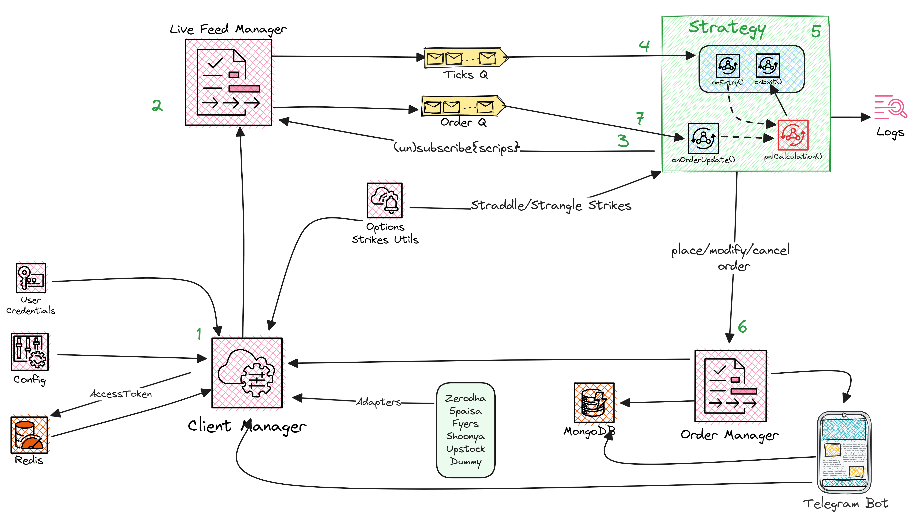

[](https://github.com/P0W/option_strategies/actions/workflows/pylint.yml)

# Option Strategies

Following writeup is just an example how to initiate a high probably trade with short strange/straddle. However much more can be achieved, please refer the [design](https://github.com/P0W/option_strategies#high-level-design) for more insights.

---

Short strangles historically has given good returns, with high probablity of profit. However the risk is high if naked strangles/staddle are placed.

The focus here is HIGH PROBABILITY OF PROFIT. 

On my experience and some backesting on stockmock and algotest.in platforms, if we short strikes near to 1 standard deviation OTM, there's a high probability of profit.
And instead of hedging with yet another OTMs on individual legs, we can place a stop loss order at 65% from entry price on both legs.
On expiry we can do same with straddle (short ATM PE and CE), with 65% stop loss on both legs.

Trailing stop loss also reduces loss days and can be tried out. Do check out the [`backtest`](https://github.com/P0W/option_strategies/tree/main/backtest) for more interesting insights.

We can also place a **_live monitor_** feed to monitor MTM on both legs and sqaure off if either a provided MTM SL is hit or a provided  MTM target is achieved for the day.

---
This repository contains a Python-based automated trading strategy for implementing daily short strangle/straddle options trading on weekly contracts of NIFTY, BANKNIFTY, and FINNIFTY indices.

This README provides comprehensive instructions for setting up the environment and deploying the strategy effectively.

## Prerequisites

Before you begin, ensure you have the following prerequisites in place: (currently works only with 5paisa brokerage account only)

- **5paisa Brokerage Account:** You need an active [**brokerage account**](https://www.5paisa.com/demat-account?ReferralCode=58194614&ReturnUrl=invest-open-account)  with 5paisa to execute trades through their API.
- **Python 3.9+:** The strategy is built using Python, so you need to have Python version 3.9 or higher installed.
- **5paisa Python SDK:** You must install the `py5paisa` Python package, which serves as the SDK for interacting with the 5paisa API.

## Installation and Setup
1. Create a virtual environment and activate it, you may use conda as well
   ```sh
   python -m venv .
   ```
2. Install  `py5paisa==0.6.7` and `requests` package or directly use `requirements.txt` file using the following command:

    ```sh
   pip install -r requirements.txt
    ```

3. Configure API Keys:
Follow the instructions in the [official 5paisa documentation](https://tradestation.5paisa.com/apidoc) to obtain your API keys. These keys will be used to authenticate and authorize the trading operations. One can use the use their TOTP login as well.

4. Create a `creds.json` file:
Create a file named `creds.json` in the root directory of your project. Populate it with the following fields obtained from the API key setup and additional details as required for 0.6.7 version of py5paisa SDK:

```json
{
   "APP_NAME": "YOUR_APP_NAME",
   "APP_SOURCE": "YOUR_APP_SOURCE",
   "USER_ID": "YOUR_USER_ID",
   "PASSWORD": "YOUR_PASSWORD",
   "USER_KEY": "YOUR_USERKEY",
   "ENCRYPTION_KEY": "YOUR_ENCRYPTION_KEY"
   "email": "YOUR_LOGIN_EMAIL",
   "passwd": "YOUR_LOGIN_PASSWORD",
   "dob": "YOUR_DOB",
   "totp_secret": "YOUR_TOTP_SECRET", 
   "pin": "YOUR_PIN",
   "clientcode": "YOUR_CLIENT_CODE",
   "telegram_token":"TELEGRAM_BOT_TOKEN" 
}
```
Note: 
-  _`totp_secret` Can be obtained very first time you add TOTP based login to your authenticator app_
-  _`telegram_token` Only if interested for telegram updates for MTM and order updates_

## Usage

The trading strategy is implemented through the [`daily_short.py`](https://github.com/P0W/option_strategies/tree/main/daily_short.py) script. Here are the available command-line options:

<details>
<summary>Click to expand</summary>

```
Options:
  -h, --help            Show this help message and exit
  --creds CREDS         Credentials file for 5paisa account login
  -s, --show-strikes-only
                        Display available strikes without placing orders
  --monitor-target MONITOR_TARGET
                        Continuously monitor for the specified target amount
  -cp CLOSEST_PREMIUM, --closest_premium CLOSEST_PREMIUM
                        Search for strangle strikes based on closest premium
  -sl STOP_LOSS_FACTOR, --stop_loss_factor STOP_LOSS_FACTOR
                        Set stop loss as a percentage above the placed price
  -q QUANTITY, --quantity QUANTITY
                        Quantity for shorting (Lot size = 50)
  --index INDEX         Choose index to trade (NIFTY/BANKNIFTY)
  --tag TAG             Display status of the last order with the given tag; when combined with --monitor_target, it polls the position for the given tag
  --log-level LOG_LEVEL
                        Set log level (INFO|DEBUG); default = DEBUG
  --pnl                 Display current Profit and Loss (PNL)
  --strangle            Place Strangle orders
  --straddle            Place Straddle orders
  ```

## Sample Run
1. _Short strangle with 8 lots of NIFTY (8*50 = 400) on strikes having preminum closest to 8.0 INR | Stop Loss: 55 %_
```sh
python .\daily_short.py --index NIFTY -sl 1.55 --strangle -q 400 -cp 8.0
```
2. _Short straddle with 10 lots of BANKNIFTY  (15*10 = 150) | Stop Loss: 55 %_
```sh
python .\daily_short.py --index BANKNIFTY -sl 1.55 --straddle -q 150
```
3. _Short straddle with 2 lots of FINNIFTY (40*2 = 80) on strikes having preminum closest to 12.0 INR | Stop Loss: 65 %_
```sh
python .\daily_short.py --index FINNIFTY -sl 1.65 --strangle -q 80 -cp 12.5
```
</details>

## Backtest
A simulation using [**algotest.in**](https://algotest.in/) is performed for period of Jan 1, 2021 to Aug 6, 2023. The results are added [`here`](https://github.com/P0W/option_strategies/tree/main/backtest/algotest_strategy_short_strangle_nifty.pdf)

## Deployment on Azure

For detailed deployment instructions on Azure, refer to the [`DailyShorts`](https://github.com/P0W/option_strategies/tree/main/DailyShorts) folder within this repository.

## High Level Design



## How to develop a strategy ?
<details>
<summary>Click to expand</summary>
    @TODO add details
</details>

## Future work

* Implement more the client interface for Zerodha, Fyers, Shoonya, Upstock, etc. - Need help from people having these broker accounts
* Improve Live monitoring
  * ~~Update pnl calculate to incorporate any abstract strategy~~
  * Filter closed orders - Check 5paisa API support it ? - Sent email to 5paisa team - No response yet
  * Add indicators : VWAP, ADX and Supertrend
  * Add UX to see MTM more intutively
  * Move to asyncio, if possible - likely not possible with 5paisa client
* Order Manger is currently tied little too much with 5paisa, see if we can abstract details and put it behind individual clients ?
  * Add orders to mongodb - this should be ideally done from Order Manger ?
* Check how live monitor can work with cloud integrations - Look for suitable resource
* ~~Add adapter to work with any broker's API~~
* ~~Check why 5paisa fragments/split single order with multiple lot into multiple orders with smaller lot~~
* ~~Add fake signal generator~~
* ~~Add design doc~~
* ~~Add access token in redis~~
* ~~Add updates via telegram bot~~


Thank you for using this repository. Clarifications/suggestions/pull requests/discussions are welcomed. 

Happy trading!
